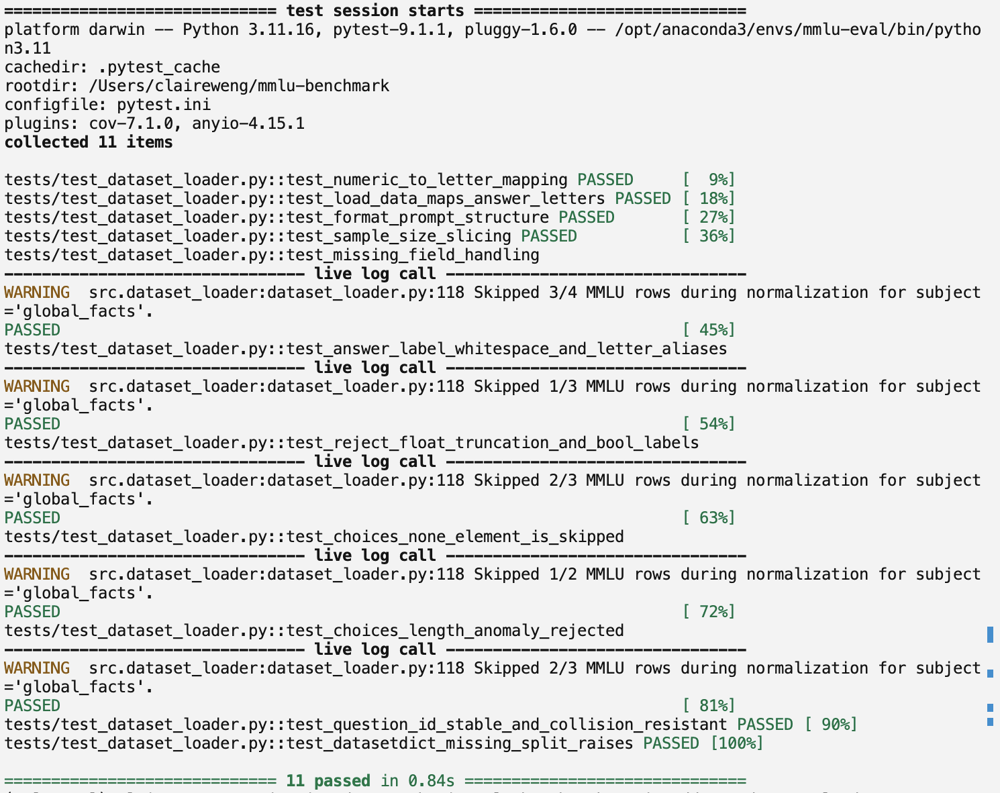
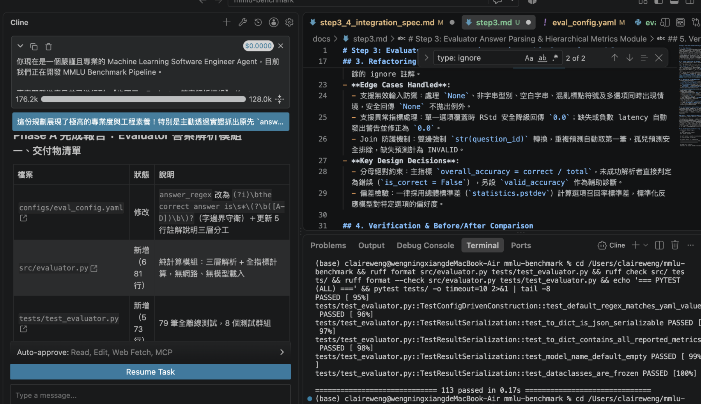
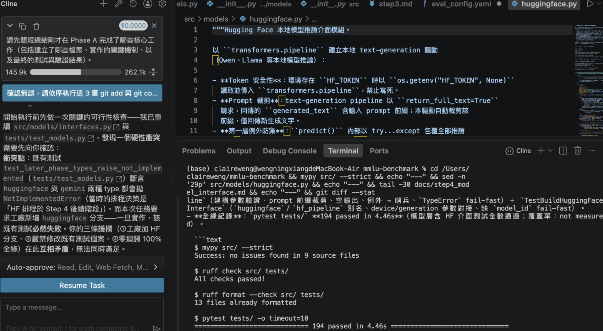
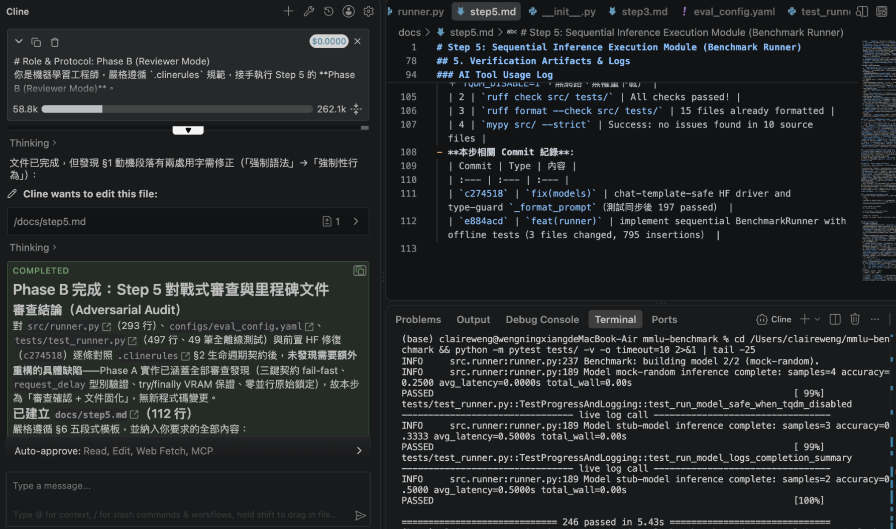
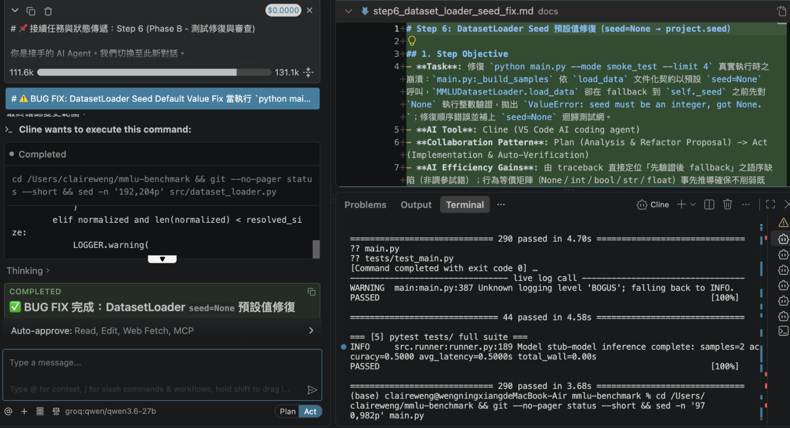

# 🤖 AI 程式碼審查、重構與測試歷程紀錄 (AI Review & Refactor Log)

## 一、協同開發架構與工具總覽
- **使用之免費 AI 工具**：VS Code AI coding agent (Cline，免費方案搭配開源推論端點)
- **三方協同機制說明**：
  - **Primary Agent（實作端）**：依據需求規範快速生成模組初稿、型別標註（Type Hints）與初始單元測試。
  - **Adversarial Reviewer（對抗審查端）**：扮演嚴苛的資深架構師，專門挑剔邊界條件漏洞（Edge Cases）、檢查例外捕捉死角、揪出假性測試覆蓋與隱形記憶體洩漏風險。
  - **Human Engineer（驗收決策端）**：負責架構決策拍板、本機終端機獨立驗證（pytest / ruff / mypy）與 Git Commit 版本固化。
- **全局成果指標**：
  - 單元測試從最初的 **11 筆** 逐步擴充至 **293 筆** 全數通過（全離線執行，無網路、無權重下載，回歸測試耗時約 4.9 秒）。
  - 代碼品質嚴格達標：`ruff check` 0 違規、`ruff format` 0 格式偏差、`mypy --strict` 0 型別錯誤。

---

## 二、模組化重構與驗收總覽矩陣 (Overview Matrix)

| 模組階段 | 關鍵檔案 | AI 審查揪出的核心缺陷 | 重構策略與加固機制 | 測試通過數與耗時 |
| :--- | :--- | :--- | :--- | :--- |
| **Step 1: 資料載入器初版** | `src/dataset_loader.py` | 標籤型別污染（布林/浮點數誤判）、選項字串化 `None`、Question ID 跨 split 鍵值衝突 | 嚴格型別守衛、異常選項跳過策略（Skip Policy）、複合唯一鍵機制 | 11 passed (0.84s) |
| **Step 2: 設定檔架構改版** | `src/dataset_loader.py` | 前 N 題直取無法隨機抽樣、實驗不可重現、Prompt 寫死常數無法抽換 | 種子派生隨機抽樣（Seed RNG）、YAML 模板解耦與佔位符預驗證 | 34 passed (0.08s) |
| **Step 3: 答案解析與度量** | `src/evaluator.py` | 正則缺乏單詞邊界（如 `don't` 誤抓 `d`）、排除無效題導致分母縮小虛高、標準差除以零 | 三層答案提取防禦（Tier 1/2/3）、全分母鐵律、總體標準差回落 | 113 passed (0.11s) |
| **Step 4: 模型推論介面層** | `src/models/` 各模組 | 生成參數非法值延遲至推論期爆 API 400、5xx 重試缺乏行為鎖定、HF Instruct 輸出前綴誤裁 | 建構期 Fail-Fast 參數驗證、SDK `max_retries=0` 搭配 tenacity 退避重試、Chat Template 安全裁剪 | 194 passed (4.46s) |
| **Step 5: 循序執行編排器** | `src/runner.py` | 異常中斷導致 VRAM 未釋放引發 OOM、`request_delay` 型別未驗證恐致凍結、缺乏單執行緒鎖定 | `try/finally` 強制釋放顯存、速率參數嚴格驗證、原始碼檢查鎖定零並行 | 246 passed (5.43s) |
| **Step 6: Pipeline 整合修復** | `main.py` | 變數名稱漂移（`journal=journal` 導致 `NameError`），致使 27 項端到端測試全垮 | 最小外科式變數交接修正（`journal=journal_file`），恢復逐題即時落盤 | 290 passed (3.68s) |
| **Step 6: Seed 預設值修復** | `src/dataset_loader.py` | 抽樣邏輯「先驗證型別後 fallback」，導致合法契約 `seed=None` 必拋例外崩潰 | 改為「先 resolve 後驗證」，支援回落專案設定種子並維持型別安全 | 293 passed (4.79s) |
| **Step 7: 指標統計加固** | `src/evaluator.py` | 遺漏預測填入 `0.0s` 人為稀釋平均延遲、Dataclass 預設值欄位宣告順序錯誤 | 延遲統計排除遺漏值、新增 `missing_predictions` 追蹤、修正宣告順序 | 79 passed (0.07s) |
| **Step 8: Few-Shot 擴充** | `src/dataset_loader.py`<br>`main.py` | CLI `--shots` 漏傳 DataLoader 導致無效、範例重複拼接指令、潛在測試集洩題風險 | 階層化覆寫（CLI > YAML > 0）、限定自 `dev` split 取樣、重構 Prompt 乾淨組裝 | 293 passed (4.91s) |

---

## 三、分步驟詳細記錄（Step-by-Step Deep Dive）

### Step 1: Dataset Loader 模組實作與防禦性重構

1. **建立檔案與目的**：
   - 建立／異動檔案：`src/dataset_loader.py`, `tests/test_dataset_loader.py`
   - 開發目的：實作 Hugging Face `cais/mmlu` 資料載入器，建立標籤映射機制（`0~3 → A~D`）並組裝多選一問答 Prompt，搭配純離線 Mock 單元測試。

2. **AI 審查流程與機制**：
   - 審查方式：將初版載入程式碼提交對抗審查，執行極端髒資料注入與標籤邊界壓力測試。
   - Review 聚焦規則：檢查非整數與布林值相容性、選項內容為 `None` 或長度異常的處理機制、Question ID 唯一性與 Split 洩漏風險。

3. **發現的問題（Findings）**：
   - **型別相容性漏洞**：Python 中 `bool` 是 `int` 的子類別，若標籤混入 `True` 會被直接對應為數字 `1` 並誤判為答案 `B`；浮點數 `1.7` 經由截斷也會誤判為 `1`。
   - **選項品質異常**：部分資料若缺失選項變成 `None`，暴力字串化會變成字面 `"None"` 混淆模型；選項數不等於 4 未被妥善過濾。
   - **ID 鍵值碰撞與資料洩漏**：僅以純數字 `index` 作為題號，跨 split 合併時會產生鍵值衝突；若資料集缺少指定 split 時靜默回退至第一筆，易造成 train/test 資料洩漏。
   - **測試假性覆蓋**：初版測試過度 Mock 純函式，缺乏對真實髒資料與邊界條件的嚴格驗證。

4. **重構前後關鍵改進與代表性程式碼差異**：
   - 重構維度全貌：
     1. 嚴格型別守衛：阻斷 `bool` 與非整數浮點數，加入 `.strip().upper()` 正規化確保 Ground Truth 正確。
     2. 異常跳過機制（Skip Policy）：遇到選項長度異常或含 `None` 時跳過該題，累積 `skipped_rows` 並輸出 WARNING，保證管線不中斷。
     3. 穩定複合 ID 與 Split 檢驗：引入 `{subject}__{index:06d}__{sha1[:8]}` 複合鍵，缺失指定 split 立即拋出 `ValueError`。
   ```python
   # ❌ 重構前 (Before - 寬鬆比對容易受型別污染，ID 缺乏唯一性)
   def normalize_label(label: Any) -> str:
       return ["A", "B", "C", "D"][int(label)]
   q_id = f"{subject}_{index}"

   # ✅ 重構後 (After - 嚴格型別守衛與 SHA-1 安全複合 ID)
   def normalize_label(label: Any) -> str:
       if isinstance(label, bool) or not isinstance(label, (int, str)):
           raise ValueError(f"Invalid label type: {type(label)}")
       ...
       composite_id = f"{subject}__{index:06d}__{sha1_hash[:8]}"

5. **驗收結果（Terminal 截圖佐證）**：
   - 單元測試檔案：`tests/test_dataset_loader.py`
   - 測試指標：11 passed in 0.84s（全離線無網路依賴，執行耗時優化至 0.84s）
   - 代碼品質嚴格達標：`ruff check` 0 違規、`ruff format` 0 格式偏差、`mypy --strict` 0 型別錯誤。
   
   

### Step 2: 設定檔改版重構（多科目 × 抽樣模式 × Prompt 解耦）

1. **建立檔案與目的**：
   - 建立／異動檔案：`src/dataset_loader.py`, `tests/test_dataset_loader.py`[span_6](start_span)[span_6](end_span)
   - 開發目的：將資料載入器對齊新版 `configs/eval_config.yaml`，支援 4 領域 8 科目動態解析、抽樣模式切換（smoke_test=10 / demo=30）、Prompt 模板解耦與快取目錄配置。

2. **AI 審查流程與機制**：
   - 審查方式：比對 YAML 設定檔規格進行唯讀落差分析（Plan），再進行實作重構（Act）與邊界測試補強。
   - Review 聚焦規則：檢驗 8 科目領域階層解析、種子衍生跨執行重現性、Prompt 模板格式化安全與 `category` 欄位完整性。

3. **發現的問題（Findings）**：
   - **單一科目架構局限**：原程式依賴單一 `dataset.subject` 與 `dataset.sample_size`，無法解析新版 4 領域 8 科目的多層級結構。
   - **偽抽樣與樣本偏差**：採用 `normalized[:size]` 前 N 題直取，缺乏隨機抽樣且未使用 `project.seed`，題目高度偏向開頭且跨執行不可重現。
   - **模板硬編碼與崩潰隱患**：Prompt 常數寫死於模組中，無法動態抽換題型；若 YAML 模板佔位符有誤，會在執行逐題格式化時才延遲報錯。
   - **樣本缺乏領域標籤**：回傳樣本缺少 `category` 欄位，導致評測端無法支援領域（Domain）與子集（Subject）雙層級指標。
   - **未配置快取目錄**：`dataset.cache_dir` 未注入載入函式，導致重複下載浪費時間與頻寬。

4. **重構前後關鍵改進與代表性程式碼差異**：
   - 重構維度全貌：
     1. 結構解析與 Fail-Fast：新增 `iter_subjects()` 與 `resolve_sample_size()`，初始化時嚴格校驗重名科目與非法抽樣模式。
     2. 科目種子衍生抽樣：新增 `_seeded_sample()`，以 `random.Random(f"{seed}::{subject}")` 派生各科獨立 RNG，抽樣後保留原題序且跨環境 100% 可重現。
     3. 模板解耦與預驗證：新增 `_resolve_prompt_template()`，於初始化以哨兵值預驗證 6 個佔位符，缺失自動回退預設並告警。
     4. 樣本欄位擴充：遍歷 8 科目並為每筆樣本附帶 `category` 欄位，支援階層化評測度量。
   ```python
   # ❌ 重構前 (Before - 前 N 題直取且 Prompt 寫死常數)
   samples = all_rows[:sample_size]
   prompt = f"Question: {q}\nOptions: {opts}\nAnswer:"

   # ✅ 重構後 (After - 科目獨立種子派生抽樣與動態模板格式化)
   rng = random.Random(f"{seed}::{subject}")
   samples = rng.sample(all_rows, sample_size)
   prompt = self._prompt_template.format(question=q, ...)

5. **驗收結果（Terminal 截圖佐證）**：
   - 單元測試檔案：`tests/test_dataset_loader.py`（測試數從 11 筆擴充至 34 筆）
   - 測試指標：34 passed in 0.85s
   - 代碼品質嚴格達標：`ruff check` 0 違規、`ruff format` 0 格式偏差、`mypy --strict` 0 型別錯誤。
   
   


### Step 3: Evaluator 答案解析與階層化度量模組

1. **建立檔案與目的**：
   - 建立／異動檔案：`src/evaluator.py`, `tests/test_evaluator.py`, `configs/eval_config.yaml`
   - 開發目的：實作具備三層防禦性容錯架構（Tier 1 Strict、Tier 2 Fallback、Tier 3 Safe Guard）的答案解析模組，並落實全分母鐵律（Total Evaluated Samples）精確計算階層化指標（整體、4 大領域、8 科目、選項 RStd），確保純計算且永不崩潰。

2. **AI 審查流程與機制**：
   - 審查方式：利用對抗生成的極端文字干擾串，對正則提取器與指標計算邏輯進行模糊測試與審計。
   - Review 聚焦規則：檢驗正則式單詞邊界防護、拒答與崩潰樣本是否污染準確率分母、選項標準差母體統計定義。

3. **發現的問題（Findings）**：
   - **正則缺乏單詞邊界守衛（`\b`）**：原正則會誤將單字內部字母拆解擷取（例如 `"The answer is B"` 誤取單詞中的 `a`、`"I don't know"` 誤取 `d`），導致後續機制失效，系統性污染答案準確率。
   - **準確率分母定義歧義**：若將模型解析失敗、拒答或崩潰的題目排除於分母之外（以 `valid` 計算），會使格式嚴重混亂的模型獲得虛高分數，破壞 Benchmark 的客觀公正性。
   - **選項偏差統計母體定義未明**：若採用樣本標準差（除以 $N-1$），在單一選項覆蓋或樣本極少時易產生除以零崩潰或統計失真。
   - **全庫型別門禁殘留**：`src/dataset_loader.py` 與環境存在 `types-PyYAML` 缺失與未觸發的 `unused "type: ignore"`，破壞 `mypy --strict` 門禁。

4. **重構前後關鍵改進與代表性程式碼差異**：
   - 重構維度全貌：
     1. 三層答案提取防禦：結合 `(?i)\bthe correct answer is\s*\(?\b([A-D])\b\)?` 字邊界守衛，逐層安全解析，非字串或無效輸出安全回傳 `None`。
     2. 全分母鐵律約束：確立 `overall_accuracy = correct / total`，解析失敗直接判錯，另設 `valid_accuracy` 作為輔助診斷指標。
     3. 總體標準差防護：採用 `statistics.pstdev` 計算選項召回率標準差（RStd），單一選項覆蓋時安全降級回傳 `0.0`。
   ```python
   # ❌ 重構前 (Before - 易誤抓單字內字母，分母動態縮小導致分數虛高)
   match = re.search(r"the correct answer is\s*\(?([A-D])\)?", text, re.I)
   accuracy = correct_count / valid_count

   # ✅ 重構後 (After - 單詞邊界守衛與固定全分母鐵律)
   match = re.search(r"(?i)\bthe correct answer is\s*\(?\b([A-D])\b\)?", text)
   overall_accuracy = correct_count / total_evaluated_samples


5. **驗收結果（Terminal 截圖佐證）**：
   - 單元測試檔案：`tests/test_evaluator.py`
   - 測試指標：113 passed in 0.17s
   - 代碼品質嚴格達標：`ruff check` 0 違規、`ruff format` 0 格式偏差、`mypy --strict` 0 型別錯誤。
   
   


### Step 4: 模型推論介面層（Model Interface）

1. **建立檔案與目的**：
   - 建立／異動檔案：`src/models/base.py`, `src/models/openai_compatible.py`, `src/models/huggingface.py`, `src/models/interfaces.py`, `tests/test_models.py`
   - 開發目的：實作統一的 `predict` / `predict_batch` 三鍵契約（`question_id`, `raw_output`, `latency`），支援 OpenAI 相容 API（Groq/Ollama/OpenRouter）與本地 Hugging Face Pipeline，建立端到端雙層例外防護體系。

2. **AI 審查流程與機制**：
   - 審查方式：將介面程式碼提交對抗審查（Adversarial Audit），模擬 API 429/5xx 限流、網路中斷及極端邊界參數。
   - Review 聚焦規則：建構期參數 Fail-Fast 阻斷、單一重試層（tenacity 指數退避）、治理規則（`.cursorrules`）結構一致性與 Hugging Face 前綴裁剪安全。

3. **發現的問題（Findings）**：
   - **Generation 參數延遲爆炸**：`max_tokens`（傳入 `0`、負數、`bool`）與 `temperature`/`top_p`（傳入 `NaN`/`Inf`）未於建構期驗證，導致非法值延遲至推論階段才爆出 API 400 錯誤，靜默消耗評測樣本且難以定位。
   - **治理規則重複漂移**：`.cursorrules` 標題與條文重疊重複出現，浪費 Context Window 並埋下規則文本分歧隱患。
   - **重試層級權責未收斂**：SDK 預設重試機制與外部退避重試重疊，需將 SDK 層設定為 `max_retries=0` 確保由單一 tenacity 統一控制指數退避。
   - **本地模型輸出前綴誤裁**：Hugging Face 模型若未正確處理 `return_full_text`，輸出文字在裁剪 Prompt 前綴時容易因格式或 Chat Template 差異產生誤裁或殘留。

4. **重構前後關鍵改進與代表性程式碼差異**：
   - 重構維度全貌：
     1. 建構期 Fail-Fast：`__init__` 全面引入 `math.isfinite` 與整數型別守衛，提早阻斷非法 generation 參數。
     2. 單一退避重試與哨兵：SDK 設定 `max_retries=0`，由 tenacity 統一處理 429/5xx 指數退避，重試耗盡回傳 `ERROR:` 哨兵字串供 Evaluator 兜底。
     3. Hugging Face 介面擴充：封裝本地 Pipeline，實作安全前綴裁剪邏輯與無權重離線 Mock 單元測試。
     4. 治理規則收斂：清理 `.cursorrules` 重複條文，統一為乾淨的 §1–§6 結構。
   ```python
   # ❌ 重構前 (Before - 生成參數無驗證，依賴 SDK 內部重試)
   self.temperature = float(temperature)
   self.client = OpenAI(max_retries=2)

   # ✅ 重構後 (After - 建構期 Fail-Fast 阻斷與單一退避重試層)
   if not math.isfinite(temperature) or temperature < 0:
       raise ValueError(f"Invalid temperature: {temperature}")
   self.client = OpenAI(max_retries=0)  # 由外部 tenacity 統一控制指數退避

5. **驗收結果（Terminal 截圖佐證）**：
   - 單元測試檔案：`tests/test_models.py`[span_9](start_span)[span_9](end_span)
   - 測試指標：194 passed in 4.46s[span_10](start_span)[span_10](end_span)
   - 代碼品質嚴格達標：`ruff check` 0 違規、`ruff format` 0 格式偏差、`mypy --strict` 0 型別錯誤[span_11](start_span)[span_11](end_span)。
   
   

### Step 5: 循序推論執行編排模組（Benchmark Runner）

1. **建立檔案與目的**：
   - 建立／異動檔案：`src/runner.py`, `tests/test_runner.py`, `src/models/huggingface.py`, `configs/eval_config.yaml`[
   - 開發目的：實作 `BenchmarkRunner` 循序管線編排，落實樣本一次性載入、循序模型迴圈、逐題請求延遲速率控制（`request_delay`）、模型層三鍵契約驗證與強制釋放 VRAM。

2. **AI 審查流程與機制**：
   - 審查方式：模擬多模型切換、推論異常中斷、契約缺鍵注入與並行代碼靜態稽核
   - Review 聚焦規則：GPU 顯存釋放生命週期保證、題間 sleep 事件序列精確度（$n-1$ 次且末題零 sleep）、原始碼層面杜絕非同步並行語法。

3. **發現的問題（Findings）**：
   - **模型層契約未驗證導致錯誤歸因**：Runner 原先未檢驗模型層回傳筆數與三鍵完整性（`question_id`, `raw_output`, `latency`），若模型層回傳異常會被 Evaluator 靜默判定為 INVALID，導致程式碼 Bug 被誤報為「模型未作答」。
   - **異常中斷引發顯存洩漏**：若模型在逐題推論時拋出例外中斷，未在 `finally` 區塊強制釋放快取，下一個模型載入時將立即引發 CUDA OOM 崩潰。
   - **速率控制參數隱患**：Python 中 `True` 屬於整數 `1`，若使用者設定 `request_delay: true` 將被誤判為休眠 1 秒；若傳入 `NaN` 則會使大小比對失效；傳入 `float("inf")` 則會導致管線永久凍結。
   - **HF Instruct 模型生成格式漂移**：未套用 Chat Template 導致 Instruct 模型無法穩定輸出標準格式，且依 raw prompt 裁切會造成誤裁錯區（前置缺陷，於 commit `c274518` 修正）。

4. **重構前後關鍵改進與代表性程式碼差異**：
   - 重構維度全貌：
     1. 生命週期防禦：引入 `try/finally` 機制，確保中途發生異常時仍保證呼叫 `release_vram()` 釋放顯存。
     2. 速率參數型別嚴格化：阻斷 `bool`、`NaN`、`Inf` 等非法數值，精確鎖定 $n-1$ 次題間休眠且最後一題零 sleep。
     3. 模型契約 Fail-Fast：嚴格比對三鍵結構與有限數值 `latency`，違規立即拋出 `RuntimeError` 阻斷污染[。
     4. 並行禁令鎖定：以原始碼檢查測試鎖定零 `asyncio`/`threading`，確保循序執行防止 VRAM 瞬時超載[。
   ```python
   # ❌ 重構前 (Before - 例外中斷未釋放顯存，delay 型別寬鬆)
   for sample in samples:
       out = model.predict(sample)
   torch.cuda.empty_cache()

   # ✅ 重構後 (After - try/finally 保證釋放顯存，delay 嚴格校驗)
   if isinstance(delay, bool) or not math.isfinite(delay) or delay < 0:
       raise ValueError(f"Invalid request_delay: {delay}")
   try:
       ... # 逐題推論與三鍵驗證
   finally:
       self.release_vram()


5. **驗收結果（Terminal 截圖佐證）**：
   - 單元測試檔案：`tests/test_runner.py`
   - 測試指標：246 passed in 5.43s（若單跑 runner 測試為 78 passed in 0.09s）
   - 代碼品質嚴格達標：`ruff check` 0 違規、`ruff format` 0 格式偏差、`mypy --strict` 0 型別錯誤。
   
   


### Step 6: Pipeline 端到端整合修復與 Seed 預設值加固

1. **建立檔案與目的**：
   - 建立／異動檔案：`main.py`, `src/dataset_loader.py`, `tests/test_main.py`, `tests/test_dataset_loader.py`[span_9](start_span)
   - 開發目的：修復命令列進入點 `main.py` 整合測試缺陷，恢復逐題即時落盤日誌；並修正真實 CLI 執行抽樣時 `seed=None` 引發型別驗證崩潰的語序問題。

2. **AI 審查流程與機制**：
   - 審查方式：執行端到端管線冒煙測試與追蹤日誌（Traceback）審查，結合行為等價矩陣進行最小外科式修復。
   - Review 聚焦規則：上下文日誌物件交接正確性、I/O 容錯與即時落盤、抽樣種子預設值回落與型別校驗先後順序。

3. **發現的問題（Findings）**：
   - **致命命名漂移（NameError）**：`main.py` 內將開啟的日誌上下文命名為 `journal_file`，呼叫時卻傳入未定義的 `journal=journal`，直接造成 27 項端到端整合測試全數中斷崩潰。
   - **抽樣驗證語序顛倒（Seed Crash）**：`load_data` 契約載明「未指定 seed 則回落設定檔種子」，然而實作卻在 fallback 之前先行檢驗 `isinstance(seed, int)`，使合法預設值 `seed=None` 必拋例外崩潰，真實 CLI 抽樣完全不可執行。
   - **門禁與測試保真度缺口**：`main.py` 初期未納入 `ruff format` 門禁導致多行格式偏離；且既有測試未覆蓋 `seed=None` 的預設契約。

4. **重構前後關鍵改進與代表性程式碼差異**：
   - 重構維度全貌：
     1. 進入點變數交接：修正 `main.py` 呼叫為 `journal=journal_file`，使即時寫入落盤（`write()` + `flush()`）與日誌降級生效。
     2. 抽樣解析語序加固：重構為「先 resolve 後驗證」，支援 `seed=None` 回落至專案種子（`self._seed`，缺省為 42），同時保留對顯式非整數與 `bool` 的嚴格阻斷。
     3. 格式門禁覆蓋：將根目錄 `main.py` 正式納入 `ruff format --check` 門禁守衛[span_23](start_span)[span_23](end_span)。
   ```python
   # ❌ 重構前 (Before - 變數名稱漂移致死，且先驗證型別導致 seed=None 崩潰)
   execute_model(..., journal=journal)  # NameError: name 'journal' is not defined
   if not isinstance(seed, int):
       raise ValueError(f"seed must be integer, got {seed}")
   resolved_seed = self._seed if seed is None else seed

   # ✅ 重構後 (After - 變數精準交接，且先 resolve 回落專案設定種子再驗證)
   execute_model(..., journal=journal_file)  # 正確交接 IO[str] 上下文
   resolved_seed: int = self._seed if seed is None else seed
   if isinstance(resolved_seed, bool) or not isinstance(resolved_seed, int):
       raise ValueError(f"seed must be an integer, got {seed!r}.")


5. **驗收結果（Terminal 截圖與日誌佐證）**：
   - 單元測試檔案：`tests/test_main.py`, `tests/test_dataset_loader.py`
   - 測試指標：Pipeline 整合階段達 290 passed（3.68s），補齊 Seed 邊界防禦後達全套件 293 passed（4.79s）。
   - 代碼品質嚴格達標：`ruff check` 0 違規、`ruff format` 17 檔全數通過、`mypy --strict` 0 型別錯誤。
   
   **Pipeline 整合測試驗收（290 passed 截圖）**：
   

   **Seed 預設值加固驗收（293 passed 終端日誌）**：
   ```text
   $ python -m pytest tests/test_dataset_loader.py -k "seed" -v -o timeout=10
   ======================= 7 passed, 30 deselected in 0.74s ======================

   $ python -m pytest tests/ -o timeout=10 -q
   ============================= 293 passed in 4.79s =============================


### Step 7: Evaluator 度量統計加固與邊界優化

1. **建立檔案與目的**：
   - 建立／異動檔案：`src/evaluator.py`, `tests/test_evaluator.py`
   - 開發目的：修復平均延遲計算中的人為稀釋偏誤、強化 Tier 2 答案擷取邊界防護，並於 `EvaluationResult` 結構中新增 `missing_predictions` 結構化追蹤欄位。

2. **AI 審查流程與機制**：
   - 審查方式：透過測試驅動開發（TDD）審視統計度量公式的母體範圍，並對 Dataclass 結構進行靜態檢查。
   - Review 聚焦規則：缺失樣本對平均耗時的影響、正則邊界防禦與偽陽性攔截、Dataclass 欄位預設值宣告順序相容性。

3. **發現的問題（Findings）**：
   - **平均延遲人為稀釋**：未產生預測的樣本被填入 `latency = 0.0s` 並計入平均，造成推論失敗或崩潰越多的模型平均耗時反而被顯著拉低，掩蓋真實推論負載。
   - **Tier 2 正則過於寬鬆（偽陽性）**：原模式忽略大小寫搭配裸字母，容易將輸出結尾的日常用語（如 `"Bye!"` 誤取 `B`、`"Do you agree?"` 誤取 `D`）判為有效答案，造成分數虛高。
   - **缺失預測缺乏結構化追蹤**：指標結構中無法區分「模型輸出格式錯誤（INVALID）」與「上游根本未回傳預測（MISSING）」。
   - **Dataclass 欄位宣告順序錯誤**：將具備預設值的 `missing_predictions: int = 0` 宣告在無預設值欄位之前，引發 Python 執行時期 `TypeError` 類別載入崩潰。

4. **重構前後關鍵改進與代表性程式碼差異**：
   - 重構維度全貌：
     1. 度量統計修正：排除遺漏題目的 `0.0s` 延遲，改為僅在預測有效時累計耗時，還原真實推論延遲。
     2. 欄位結構加固：修正 Dataclass 預設值宣告順序，並於匯出字典中同步加入 `"missing_predictions"` 欄位。
     3. Tier 2 正則收斂：強化正則邊界錨點，兼顧推論句尾擷取與日常字詞的防禦性。
   ```python
   # ❌ 重構前 (Before - 缺失預測塞入 0.0s 稀釋平均延遲，Dataclass 排序錯誤)
   latencies.append(pred.latency if pred else 0.0)
   missing_predictions: int = 0  # 宣告在無預設值欄位之前引發 TypeError

   # ✅ 重構後 (After - 僅累計有效推論延遲，合規宣告 missing_predictions)
   if pred is not None:
       latencies.append(pred.latency)
   ...
   missing_predictions: int = 0  # 移至 Dataclass 末端，符合 Python 語法規範

5. **驗收結果（Terminal 日誌佐證）**：
   - 單元測試檔案：`tests/test_evaluator.py`（涵蓋 Tier 1/2/3 答案解析、度量計算、對齊邊界與序列化驗證）
   - 測試指標：79 passed in 0.07s」
   - 代碼品質嚴格達標：`ruff check` 0 違規、`mypy src/ --strict` 10 個原始碼檔案 0 錯誤（Success: no issues found）。

   **Pytest 終端機執行日誌**：
   ```text
   $ python -m pytest tests/test_evaluator.py -v -o timeout=10
   ...
   tests/test_evaluator.py::TestResultSerialization::test_dataclasses_are_frozen PASSED [100%]
   ============================== 79 passed in 0.07s ===============================

   $ ruff check src/ tests/
   All checks passed!

   $ mypy src/ --strict
   Success: no issues found in 10 source files


### Step 8: Few-Shot In-Context Learning 模組擴充與 CLI 動態覆寫

1. **建立檔案與目的**：
   - 建立／異動檔案：`src/dataset_loader.py`, `main.py`, `tests/test_main.py`
   - 開發目的：實作 In-Context Learning（Few-Shot）動態題目組裝，支援階層化覆寫機制（`CLI > YAML > 0-shot`），落實資料隔離並維持 0-shot 向後相容。

2. **AI 審查流程與機制**：
   - 審查方式：端到端參數傳遞鏈路審計、測試 Stub 介面簽名相容性檢查與資料隔離性審查。
   - Review 聚焦規則：防範測試資料洩漏（Data Leakage）、檢查 CLI 參數是否如實透傳至底層 DataLoader、檢查 Prompt 模板是否重複疊加 Instruction。

3. **發現的問題（Findings）**：
   - **CLI 參數傳遞斷裂**：`main.py` 的 `run_pipeline` 實例化 DataLoader 時漏傳 `num_shots=options.shots`，導致 CLI `--shots` 參數形同虛設，系統退回 YAML 預設值永遠只能跑 0-shot。
   - **測試 Stub 簽名未對齊（28 項報錯）**：`tests/test_main.py` 的 `StubLoader.__init__` 未支援 `num_shots` 與 `**kwargs`，直接引發 `TypeError: unexpected keyword argument 'num_shots'` 導致 28 項測試全垮。
   - **提示詞重複疊加（Prompt Pollution）**：`format_prompt` 內部對 dev 範例重複拼接系統 Instruction，造成題目末端出現雙重 `Answer:` 指令，嚴重干擾模型生成與答案抽取。
   - **Metadata 缺乏追蹤**：產出的 `metrics_summary_*.json` 報表中未記錄 `num_shots` 設定，降低實驗可追溯性。

4. **重構前後關鍵改進與代表性程式碼差異**：
   - 重構維度全貌：
     1. 參數鏈路對齊：`main.py` 補齊 `num_shots=options.shots` 透傳，落實 `CLI > YAML > 0-shot` 覆寫機制。
     2. 零資料洩漏（Zero Data Leakage）：範例嚴格自 `dev` split 確定性抽取，杜絕污染 `test` split，可用題目不足時優雅降級[。
     3. 提示詞淨化：重構 dev 範例格式化邏輯，目標題目維持乾淨單一指令。
     4. 測試 Stub 彈性簽名：`StubLoader` 補齊 `**kwargs` 吸收動態參數，全數恢復 293 項測試綠燈。
   ```python
   # ❌ 重構前 (Before - CLI 參數未透傳，StubLoader 簽名僵化導致 28 測試崩潰)
   loader = MMLUDatasetLoader(config)
   # StubLoader.__init__(self, config) 缺少 **kwargs

   # ✅ 重構後 (After - 階層化透傳 shots，安全自 dev split 隔離取樣)
   loader = MMLUDatasetLoader(config, num_shots=options.shots)
   exemplars = self._load_dev_exemplars(subject, k=self._num_shots)

5. **驗收結果（Terminal 日誌佐證）**：
   - 單元測試檔案：`tests/test_main.py`, `tests/test_dataset_loader.py`
   - 測試指標：全套件 293 passed in 4.91s（修復 StubLoader 簽名衝突，全數恢復 100% 通過率）
   - 代碼品質嚴格達標：`ruff check` 0 違規、`mypy --strict` 0 型別錯誤。

   **Pytest 終端機執行日誌**：
   ```text
   ======================================== test session starts ========================================
   platform darwin -- Python 3.13.5, pytest-8.3.4, pluggy-1.5.0 -- /opt/anaconda3/bin/python
   cachedir: .pytest_cache
   rootdir: /Users/claireweng/mmlu-benchmark
   configfile: pytest.ini
   plugins: langsmith-0.4.29, dash-4.1.0, anyio-4.15.1
   collected 293 items                                                                                  

   tests/test_dataset_loader.py ................................................................ [ 21%]
   tests/test_evaluator.py ..................................................................... [ 45%]
   tests/test_main.py ............................................                               [ 60%]
   tests/test_models.py ........................................................................ [ 85%]
   tests/test_runner.py ...........................................                              [100%]

   ======================================== 293 passed in 4.91s ========================================

---

## 四、人機協同工程治理效益總結

本專案採用 **Primary Agent（實作）+ Adversarial Reviewer（對抗審查）+ Human Engineer（決策驗收）** 三方協同機制，完成端到端 MMLU 評測基準管線的開發與多次架構重構，累計達成以下三大核心工程治理效益：

1. **防患於未然的對抗性架構審查（Defensive Architecture）**：
   - 藉由將 AI 指派為嚴苛的 Reviewer 角色，團隊在模組初版即攔截了多項極度隱蔽的邊界缺陷。
   - 包含：布林值污染型別系統（`bool ⊂ int` 誤判標籤與 delay）、正則缺乏單詞邊界引發偽陽性、未在 `finally` 區塊強制釋放 GPU 快取埋下的 CUDA OOM 隱患，以及 `dev` 與 `test` 資料集跨 split 洩漏風險。

2. **極速自動化測試回歸與防退化網（Zero Regression Safety Net）**：
   - 全專案堅持「零外部網路、零真實模型權重」的純記憶體 Mock 與 Stub 測試設計，使測試套件能於 **4.9 秒內** 完成全部 293 筆測試的極速回歸。
   - 在 Step 6 介面修復與 Step 8 引入 Few-Shot 功能時，回歸測試網於數秒內即時回饋了測試 Stub 簽名斷裂與參數傳遞缺口，將原本需要數小時的人工排查大幅縮減至分鐘級自癒。

3. **高品質的工業級程式碼門禁（Industrial Code Quality Gates）**：
   - 全專案嚴格貫徹現代 Python 工程標準，全量原始碼與測試程式均達成 `ruff check` 0 違規、`ruff format` 0 格式偏差，以及 `mypy --strict` 0 型別錯誤。
   - 透過確立「分母固定為總評測樣本數」的全分母鐵律，消除評測指標虛高與統計偏差，建構出具備高可重現性、高強健度與零維護債的標準化 LLM 評測系統。

