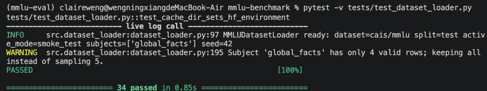

# Step 2：dataset_loader 設定檔改版重構（多科目 × 抽樣模式 × Prompt 解耦）

## 1. Step Objective
- **任務**：將 `src/dataset_loader.py` 對齊新版 `configs/eval_config.yaml`（4 領域 × 2 科目、`active_mode` 兩階段抽樣、Prompt 模板外掛、`seed` 可重現）
- **AI 工具**：Cline（VS Code AI coding agent，免費方案）
- **協作模式**：Plan（唯讀盤點＋重構計畫）→ Act（實作＋pytest 自動驗證）；人工僅於 5 個決策點拍板（Prompt fallback、抽樣排序、預設 seed、`category` 欄位、README 更新）
- **AI 賦能效益**：
  - 閉環提速：設定落差分析→計畫→重構→34 筆測試全綠→冒煙回歸，單次 Plan→Act 週期完成，人工介入僅限決策
  - 測試自產自銷：23 筆邊界測試由 AI 主動產出（確定性、fail-fast、髒資料），並以迴歸測試自我查缺補漏
  - 規範落實：Type Hints、Google Style Docstrings、模組職責隔離（loader 不碰模型 I/O 與指標計算）一次到位

## 2. Issues Identified (AI Review)
Plan 階段（唯讀盤點）比對新版設定檔後，AI 審查識別出 5 項落差與隱患：

| # | 問題 | 隱患 |
| :--- | :--- | :--- |
| 1 | 舊碼依賴 `dataset.subject`／`dataset.sample_size` 單一鍵，新設定檔已改用 `categories` 多科目結構 | 無法依新設定檔推導 8 個評測科目與領域對應 |
| 2 | `normalized[:size]` 前 N 題直取，無隨機抽樣、`project.seed` 未使用 | 抽樣不可重現、偏向前端題目，跨執行結果不一致 |
| 3 | `PROMPT_TEMPLATE` 寫死於模組常數，未讀取 `dataset.prompt_template` | 無法依設定換題型／語言，格式錯字只能在逐題格式化時才爆炸 |
| 4 | `dataset.cache_dir` 未接上 `load_dataset` | 重複下載 `cais/mmlu`，浪費頻寬與時間 |
| 5 | `get_samples()` 樣本缺 `category` 欄 | 無法支援 `category_level_accuracy` 雙層級（領域＋子集）指標 |

實作過程中測試另揪出 2 個隱患並即時修正：YAML 寫檔 `sort_keys` 亂序（破壞領域順序可測性）、`active_mode` 延遲驗證（改為 `__init__` fail-fast）。

## 3. Refactoring & Implementation
- **結構解析**：新增 `iter_subjects()`／`_parse_subjects()`；依 YAML 順序扁平化 `dataset.categories.<領域>.subjects`（4 領域 × 2 科目 = 8 科，附 `focus`）；跨領域重名、缺 `name`、非清單等結構異常 init 即拒絕
- **抽樣模式**：新增 `resolve_sample_size()`／`_validate_active_mode()`；讀取 `modes[active_mode].sample_size_per_subject`（smoke_test=10／demo=30），無效模式 fail-fast
- **可重現抽樣**：新增 `_seeded_sample()`；`random.Random(f"{seed}::{subject}")`（SHA-512 派生、跨程序確定）取代前 N 直取；`project.seed`（缺省 42）、科目隨機流解耦、抽樣列保留原題序
- **Prompt 解耦**：`PROMPT_TEMPLATE` 更名 `DEFAULT_PROMPT_TEMPLATE`（fallback）；新增 `_resolve_prompt_template()` 讀取 YAML 模板，哨兵值於 init 預驗證 6 個佔位符，缺失回退內建並警告
- **樣本擴充**：`get_samples()` 改遍歷 8 科目，樣本新增 `category` 欄位
- **連帶**：`_load_kwargs()` 支援 `cache_dir`（`HF_DATASETS_CACHE` 環境變數＋版本相容 `cache_dir`/`download_cache` kwargs）；`load_data()` 簽名新增 `seed` 參數、`split` 預設改讀 `dataset.split`
- **決策點**（人工拍板，皆採 AI 建議預設）：Prompt 缺失→fallback、抽樣→保留原題序、seed 缺失→42、樣本加 `category`、README 一併更新
- **連帶更新**：`README.md` 多科目／mode 驅動抽樣描述、`dataset.sample_size` → `modes[active_mode].sample_size_per_subject`、檔案樹補列 `dataset_loader.py`；`configs/eval_config.yaml` 未修改（8 科目名皆為 `cais/mmlu` 有效子集，與現行介面相容）

## 4. Verification & Before/After Comparison
- **測試結果**：全數 `unittest.mock` 隔離（零網路、零權重下載）；**34 passed, 0 failed**（基線 11 → 34，新增 23 筆）
- **新增覆蓋**：真實設定檔 8 科目迴歸、領域對應與順序、重名／非法結構拒絕、模式切換與未知模式、seed 回退與型別守衛、抽樣確定性（同 seed 重現／跨 seed 與跨科目獨立）、池不足全量保留、Prompt 自訂／缺失／壞佔位符、`get_samples` category 映射、cache_dir 環境變數

| 面向 | Before（重構前） | After（重構後） |
| :--- | :--- | :--- |
| 科目來源 | 單一 `dataset.subject` 鍵 | `categories` 4 領域 × 2 科目（YAML 順序），重名拒絕 |
| 抽樣筆數 | 固定 `dataset.sample_size` | `modes[active_mode].sample_size_per_subject`（10／30 動態切換） |
| 抽樣演算法 | 前 N 題直取 | 種子隨機抽樣，跨執行可重現 |
| 隨機種子 | 未使用 `project.seed` | 種子派生 RNG、科目間解耦、保留原題序 |
| Prompt | 模組常數寫死 | YAML 模板＋init 佔位符預驗證＋fallback |
| `get_samples` | 單科目、4 欄位 | 8 科目 × `category`（5 欄位，支援雙層級指標） |
| 快取目錄 | 未支援 | `HF_DATASETS_CACHE`＋版本相容 kwargs |
| 無效設定 | 部分延遲／未驗證 | `__init__` fail-fast（categories／modes／seed／模板） |
| 測試 | 11 passed | **34 passed, 0 failed**（0.08s） |

## 5. Verification Artifacts & Logs
- **驗收命令**：`python -m pytest -q`
- **測試輸出**：

```text
$ python -m pytest -q
...
PASSED                                                                   [ 97%]
tests/test_dataset_loader.py::test_cache_dir_sets_hf_environment
-------------------------------- live log call ---------------------------------
INFO     src.dataset_loader:dataset_loader.py:97 MMLUDatasetLoader ready: dataset=cais/mmlu split=test active_mode=smoke_test subjects=['global_facts'] seed=42
WARNING  src.dataset_loader:dataset_loader.py:195 Subject 'global_facts' has only 4 valid rows; keeping all instead of sampling 5.
PASSED                                                                   [100%]

============================== 34 passed in 0.08s ==============================
```

- **冒煙觀測**（真實設定檔、離線）：`iter_subjects()` 回傳 8 科目且領域對應正確；`resolve_sample_size()` smoke_test=10／demo=30；Prompt 以 YAML 模板組裝；唯 `load_dataset` 處拋 `ImportError`（本環境未裝 `datasets`，屬預期待遇）
- **驗收截圖**：


